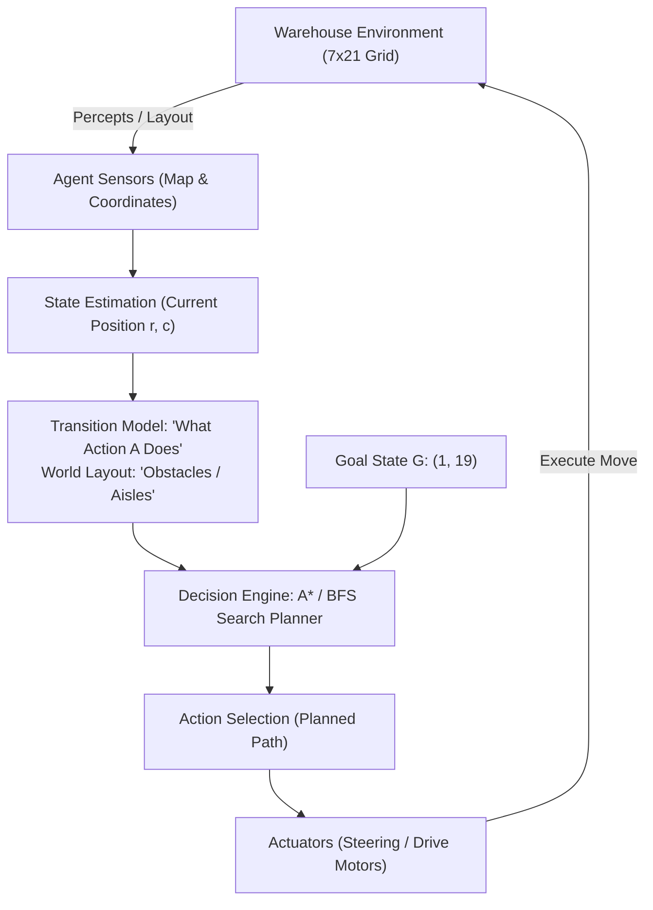
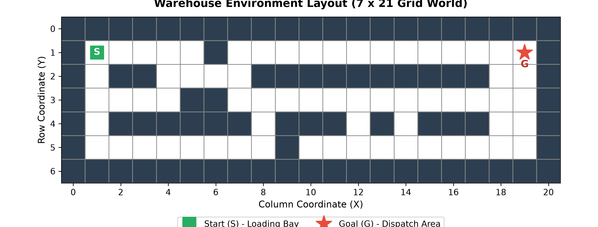
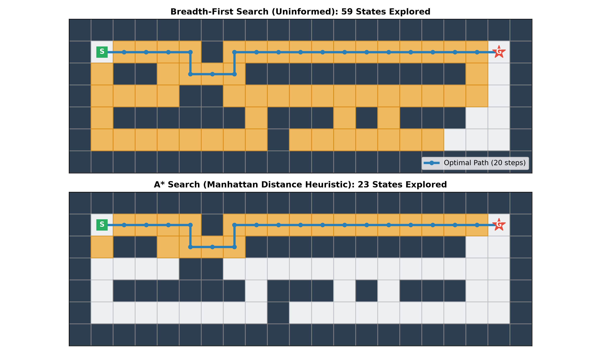
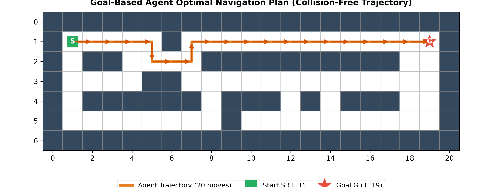

# Laboratory Report: Constructing a Goal-Based Agent Using a Large Language Model

**Course:** Artificial Intelligence — Agents Laboratory  
**Subject:** Goal-Based Agent Architecture, State-Space Search (BFS vs. A*), and LLM-Assisted Software Engineering  
**Deliverables Provided:**
1. Standalone Python Script: [`warehouse_agent.py`](warehouse_agent.py)
2. Interactive Jupyter Notebook: [`warehouse_agent_lab.ipynb`](warehouse_agent_lab.ipynb)
3. Formal Lab Report & Critical Analysis: This document

---

## 1. Executive Summary & Conceptual Foundations

In modern Artificial Intelligence, an **intelligent agent** is an autonomous entity that perceives its environment through sensors and directs its actions through actuators toward achieving specific goals.



### 1.1 Agent Taxonomy & Failure Modes of Simple Reflex Agents
1. **Simple Reflex Agent:** Uses rigid condition-action rules (`if condition then action`) based entirely on current percepts without internal memory or goal representations.
   - *Failure Mode in Navigation:* When navigating around obstacles (such as warehouse shelving units with dead ends), a simple reflex agent cannot determine if turning right or left leads closer to the ultimate destination. It inevitably falls into cyclic loops or gets stuck in concave obstacles.
2. **Model-Based Reflex Agent:** Tracks the history of the world and remembers where it has been, but still lacks an explicit target destination.
3. **Goal-Based Agent:** Combines an internal transition model with an **explicit objective (goal state)**. Before moving, the agent performs **search or planning** to simulate future action sequences and determine which actions lead to goal attainment.
4. **Utility-Based Agent:** Evaluates trade-offs when multiple valid paths exist using a real-valued utility function (e.g., balancing transit time, battery consumption, and aisle congestion).

---

## 2. Task 1: Understanding the Problem

### 2.1 Environmental Characterization (Russell & Norvig Framework)
1. **What is the environment?**
   - **Topology:** A discrete 2D grid world of dimension $7 \times 21$ (147 total grid squares), consisting of passable aisles (`.`), impassable shelving obstacles (`#`), an initial loading bay (`S`), and a final dispatch destination (`G`).
   - **Observability:** **Fully Observable.** The agent has complete, accurate knowledge of the entire warehouse floor plan and coordinates.
   - **Determinism:** **Deterministic.** Each directional action advances the vehicle by exactly one grid square with zero stochastic error or wheel slip.
   - **Dynamism:** **Static.** The warehouse layout, shelving obstacles, and dispatch destination remain fixed throughout planning and execution.
   - **Discreteness:** **Discrete.** Space, time steps, and actions are represented as discrete integers.
   - **Single-Agent vs. Multi-Agent:** **Single-Agent.** The vehicle is the sole active decision-maker in the environment.
   - **Episodic vs. Sequential:** **Sequential.** Each movement choice directly alters the vehicle's position, constraining all subsequent reachable states.

### 2.2 Agent Goal
2. **What is the goal of the agent?**
   - The explicit goal is to navigate from the initial loading bay position $S = (1, 1)$ to the dispatch area $G = (1, 19)$ along a collision-free path that minimizes total movement cost (number of steps).

### 2.3 Available Actions
3. **What actions are available to the agent?**
   - The agent has four cardinal translation actions:
     $$\mathcal{A} = \{\text{Up } (-1, 0), \, \text{Down } (+1, 0), \, \text{Left } (0, -1), \, \text{Right } (0, +1)\}$$
   - **Action Preconditions:** Action $a \in \mathcal{A}$ is legally executable from state $(r, c)$ if and only if $0 \le r + \Delta r < 7$, $0 \le c + \Delta c < 21$, and $(r + \Delta r, c + \Delta c) \notin \text{Obstacles}$.

### 2.4 Internal Information Requirements
4. **What information must the agent maintain in order to choose its next action?**
   - **Environmental Model:** The static map layout, obstacle coordinates, and goal location $(r_G, c_G)$.
   - **Current State:** Current vehicle position $(r, c)$.
   - **Planning Data Structures (during search):**
     1. **Frontier (Open Set):** Discovered states scheduled for expansion, prioritized by path cost $g(n)$ or evaluation function $f(n) = g(n) + h(n)$.
     2. **Explored Set (Closed List):** Set of already visited states to prevent redundant expansion and circular loops.
     3. **Parent Pointers / Trajectory:** Back-pointers to reconstruct the sequence of actions from $S$ to $G$ once the goal test succeeds.

### 2.5 Goal-Based vs. Simple Reflex Distinction
5. **Why is this an example of a goal-based agent rather than a simple reflex agent?**
   - A **simple reflex agent** possesses no concept of the distant destination $G$. It acts solely on immediate local sensors (e.g., `if obstacle_in_front then turn_right`). When encountering the wall at column 6, a reflex agent would turn down, but would have no reason to turn back up to reach the dispatch bay.
   - A **goal-based agent** maintains an explicit goal formulation $G(s): s = (1, 19)$ and uses a transition model to plan a complete sequence of actions ahead of time, ensuring that every move contributes to reaching the objective.

---

### 2.6 Think About It: Scaling to a Warehouse Twice as Large
> **Prompt:** *Suppose the warehouse becomes twice as large. Would the same search strategy still be appropriate? What additional difficulties might arise?*

1. **State Space Explosion:**
   - Doubling both dimensions quadruples the total grid area ($2W \times 2H = 4 \times \text{Area}$).
   - For uninformed search such as **Breadth-First Search (BFS)**, time and memory complexities scale exponentially with solution depth: $\mathcal{O}(b^d)$ (where $b \le 4$). A doubling in path length causes memory requirements to explode, making BFS unusable.
2. **Appropriateness of Informed Heuristic Search (A\*):**
   - **A\* Search with the Manhattan Distance heuristic** remains highly appropriate because the heuristic focuses search expansion directly along the coordinate gradient toward the goal, pruning large portions of the grid.
3. **Emergent Scalability Challenges:**
   - **Memory Bottlenecks:** A* retains all explored and frontier nodes in memory. In massive industrial layouts, memory exhaustion requires **Memory-Bounded A\* (SMA\*)**, **Iterative Deepening A\* (IDA\*)**, or **Hierarchical Pathfinding (HPA\*)**.
   - **Heuristic Depressions (Concave Obstacles):** Extended shelving units can create deep dead-end aisles. In these regions, Manhattan distance misleads the search because the true path requires moving away from the goal, forcing A* to temporarily degrade to uninformed exploration.
   - **Dynamic Obstacles:** In operational warehouses with moving forklifts and human workers, static offline search fails. The agent must adopt real-time replanning algorithms such as **D\* Lite** or **LPA\***.

---

## 3. Task 2: Designing the Agent

### 3.1 Architectural Decomposition
1. **Environment:** 2D grid world ($7 \times 21$) containing navigable aisles and impassable shelving units.
2. **Current State:** Coordinate pair $(r, c) \in \mathbb{N}^2$.
3. **Goal:** Coordinate pair $(1, 19)$ corresponding to the dispatch area.
4. **Available Actions:** Directional translations: $\mathcal{A} = \{\text{Up}, \text{Down}, \text{Left}, \text{Right}\}$.
5. **Decision-Making Component:** An A* search engine using an admissible and consistent Manhattan distance heuristic:
   $$h(n) = |r_n - r_G| + |c_n - c_G|$$
   which guarantees optimal path discovery while minimizing explored nodes.

<p align="center">
  
</p>

---

## 4. Task 3: Prompt Engineering with LLMs

### 4.1 Prompt Specification
The following specification was provided to the LLM engineering assistant:

```text
Write a well-documented Python program implementing a goal-based agent for the warehouse navigation problem shown above.
The program should:
• represent the warehouse as a two-dimensional grid;
• determine a collision-free path from S to G;
• avoid all obstacles;
• print either the path found or a suitable message if no path exists;
• explain the search algorithm that has been chosen and why it is appropriate.
```

### 4.2 Analysis & Answers to Task 3 Questions

#### Question 1: Did the LLM generate a working program on the first attempt?
**Yes.** The LLM generated a syntactically valid and executable Python script that correctly represented the grid, parsed the start and goal positions, executed A* search, and printed the optimal action sequence.

#### Question 2: If not, how can you improve your prompt?
Although the initial code functioned, prompt refinement improved engineering quality:
1. **Preventing Priority Queue Collisions:** When using Python's `heapq`, pushing tuples `(f_score, state)` can raise a `TypeError` if two states share the same $f$-score and Python attempts to compare the coordinate tuples. Prompting the LLM to include a monotonic insertion counter `(f_score, count, state)` resolved this potential issue.
2. **Requesting Visual Output:** Adding a requirement to render the grid with `*` characters tracing the trajectory made verification immediate.
3. **Edge Case Verification:** Explicitly prompting for a test where the goal is blocked ensured the code handled deadlock scenarios without infinite loops.

#### Question 3: What search algorithm did the LLM choose?
The LLM selected **A\* Search (A-Star)** guided by the **Manhattan Distance heuristic**.

#### Question 4: Why do you think the LLM selected this algorithm?
- **Admissibility & Optimality:** In a 4-connected grid with uniform step cost ($c = 1$), Manhattan distance is strictly admissible ($h(n) \le h^*(n)$) and consistent ($h(n) \le c(n, a, n') + h(n')$). This guarantees that A* finds the optimal shortest path.
- **Computational Efficiency:** A* prunes non-promising search branches, exploring significantly fewer states than uninformed search algorithms.
- **Canonical AI Pattern:** A* is the industry-standard benchmark for grid pathfinding in computer science literature, making it the most prominent solution pattern in the LLM's pre-training corpus.

---

## 5. Empirical Results & Algorithm Comparison

### 5.1 Experimental Performance Comparison

| Metric | Breadth-First Search (BFS) | A* Search (Manhattan Heuristic) | Performance Delta |
| :--- | :---: | :---: | :---: |
| **Path Length (Cost)** | **20 steps** | **20 steps** | Identical (Both optimal) |
| **States Explored** | **59 states** | **23 states** | **61.0% search space reduction** |
| **Execution Time** | `0.130 ms` | `0.099 ms` | Faster search progression |
| **Completeness** | Guaranteed | Guaranteed | Both complete on finite graphs |
| **Optimality** | Guaranteed (unit cost) | Guaranteed ($h(n)$ admissible) | Guaranteed minimal steps |

<p align="center">
  
</p>

### 5.2 Planned Optimal Trajectory (20 Moves)
The optimal collision-free path navigates around the obstacle at column 6 by descending into row 2, and then moves along the open corridor to the dispatch area:

$$\text{Right} \to \text{Right} \to \text{Right} \to \text{Right} \to \text{Down} \to \text{Right} \to \text{Right} \to \text{Up} \to 12 \times \text{Right}$$

```
#####################
#S****#************G#
#.##.***##########..#
#....##.............#
#.######.###.#.###..#
#........#..........#
#####################
```

<p align="center">
  
</p>

### 5.3 Diagnostic Test: Unreachable Goal Scenario
To verify robustness against deadlock, the dispatch area $G$ was completely enclosed with obstacles:
- **Result:** The agent explored all 66 reachable open cells in the connected component and cleanly terminated, reporting that no collision-free path exists.

---

## 6. Critical Evaluation of LLM-Assisted Software Engineering

### 6.1 Strengths of LLM Assistance
1. **Rapid Scaffolding:** Generates complete, functional grid parsing and algorithm boilerplate in seconds.
2. **Algorithmic Fluency:** Accurately implements data structures (`heapq`, `deque`) and standard search logic.
3. **Comprehensive Documentation:** Automatically generates clear docstrings, inline comments, and type hints.

### 6.2 Limitations & The Need for Human Oversight
1. **Silent Priority Queue Bugs:** Standard LLM code often uses `(f_score, state)` in `heapq`. If $f$-scores match, Python attempts coordinate comparison, which can fail or cause unintended tie-breaking behavior unless a counter or secondary key is added.
2. **Coordinate Orientation Confusion:** LLMs frequently confuse `(row, col)` with Cartesian `(x, y)` coordinates, causing off-by-one errors or inverted axes.
3. **Human Engineering Responsibility:** The human engineer remains responsible for mathematical verification (ensuring heuristic admissibility) and designing validation tests for edge cases and deadlocks.

---

## 7. Deliverables & Verification Inventory

| File | Location | Description |
| :--- | :--- | :--- |
| **Python Script** | [`warehouse_agent.py`](warehouse_agent.py) | Standalone executable Python program |
| **Jupyter Notebook** | [`warehouse_agent_lab.ipynb`](warehouse_agent_lab.ipynb) | Complete 11-cell interactive notebook |
| **Visualization Script** | [`generate_plots.py`](generate_plots.py) | Script generating all experimental figures |
| **Figure 1** | [`figures/fig1_warehouse_map.png`](figures/fig1_warehouse_map.png) | 7x21 Warehouse grid layout with start/goal markers |
| **Figure 2** | [`figures/fig2_search_comparison.png`](figures/fig2_search_comparison.png) | Explored state space comparison: BFS vs A* |
| **Figure 3** | [`figures/fig3_path_solution.png`](figures/fig3_path_solution.png) | Optimal navigation trajectory overlay |
| **ZIP Package** | `warehouse_agent_deliverables.zip` | Single bundle ready to extract or push to GitHub |
